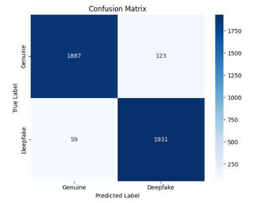

# Deepfake Audio Detection

### MARS Club IIT Roorkee – Open Projects 2026

---

## Project Overview

Recent advances in Generative AI have made it possible to synthesize highly realistic human speech. While these technologies have numerous beneficial applications, they also pose significant risks related to misinformation, voice cloning, identity theft, and digital fraud.

This project presents a Deep Learning-based Deepfake Audio Detection system capable of classifying speech recordings as either:

* Genuine (Human Speech)
* Deepfake (AI-Generated Speech)

The proposed solution converts audio recordings into Mel Spectrogram representations and employs EfficientNetB0 with transfer learning to identify discriminative patterns between authentic and synthetic speech.

The system demonstrates strong performance on unseen audio samples and satisfies all verification requirements specified in the project statement.

---

## Problem Statement

Develop a Machine Learning or Deep Learning model capable of classifying speech recordings as:

* Genuine (Human Speech)
* Deepfake (AI-Generated Speech)

The model should generalize effectively to unseen audio samples and provide robust performance on evaluation datasets.

---

## Live Demo

Streamlit Web Application:

https://deepfake-audio-detection-sgkw8zmfzcjycpmvnwjkga.streamlit.app/

---

## Dataset

### Dataset Used

**Fake-or-Real (FoR) Dataset**

The dataset consists of thousands of speech recordings belonging to two classes:

* Genuine Human Speech
* AI-Generated Speech

### Dataset Split

* Training Set
* Validation Set
* Testing Set

For this implementation, approximately **20,000 audio samples** were used during training and evaluation.

---

## Methodology

### 1. Data Collection

Audio recordings were collected from the Fake-or-Real (FoR) dataset and organized into training, validation, and testing subsets.

### 2. Audio Preprocessing

Each audio sample undergoes the following preprocessing steps:

* Audio loading using Librosa
* Mono channel conversion
* Resampling to a fixed sampling rate
* Amplitude normalization
* Mel Spectrogram generation

### 3. Feature Extraction

Mel Spectrograms are extracted from each audio recording and used as image representations of speech.

#### Why Mel Spectrograms?

* Capture important frequency-domain information
* Preserve speech characteristics effectively
* Commonly used in speech processing applications
* Compatible with CNN-based architectures

### 4. Data Preparation

* Spectrogram size: 128 × 128
* Single-channel spectrogram converted to RGB format
* Dataset shuffled before training
* Stratified train-test split applied

---

## Model Architecture

Transfer Learning is employed using EfficientNetB0 pretrained on ImageNet.

### Architecture Pipeline

Input Audio

↓

Mel Spectrogram

↓

EfficientNetB0 Feature Extractor

↓

Global Average Pooling Layer

↓

Dense Layer (128 Units, ReLU)

↓

Dropout Layer (0.4)

↓

Sigmoid Output Layer

---

## Training Configuration

| Parameter                | Value               |
| ------------------------ | ------------------- |
| Framework                | TensorFlow / Keras  |
| Model                    | EfficientNetB0      |
| Optimizer                | Adam                |
| Loss Function            | Binary Crossentropy |
| Batch Size               | 64                  |
| Epochs                   | 15                  |
| Early Stopping           | Enabled             |
| Learning Rate Scheduling | Enabled             |

---

## Project Pipeline

1. Load Audio Files
2. Preprocess Audio Signals
3. Generate Mel Spectrograms
4. Resize Spectrograms to 128 × 128
5. Convert Spectrograms to RGB Images
6. Train EfficientNetB0 Model
7. Evaluate Model Performance
8. Compute Accuracy, F1 Score, EER, and Confusion Matrix
9. Deploy Using Streamlit

---

## Performance Results

### Evaluation Metrics

| Metric                 | Score  |
| ---------------------- | ------ |
| Accuracy               | 95.45% |
| F1 Score               | 95.50% |
| Equal Error Rate (EER) | 4.47%  |

---

## Verification Requirements

| Requirement        | Threshold | Achieved |
| ------------------ | --------- | -------- |
| Accuracy           | ≥ 80%     |  95.45% |
| F1 Score           | ≥ 80%     |  95.50% |
| EER                | ≤ 12%     |  4.47%  |
| Per-Class Accuracy | ≥ 75%     |  Passed |

---

## Confusion Matrix

| Actual / Predicted | Genuine | Deepfake |
| ------------------ | ------- | -------- |
| Genuine            | 1887    | 123      |
| Deepfake           | 59      | 1931     |

### Visualization



---

## Repository Structure

```text
Deepfake-Audio-Detection
│
├── notebook
│   └── Deepfake_Audio_Detection.ipynb
│
├── models
│   └── deepfake_audio_model_20k.keras
│
├── reports
│   ├── README.md
│   └── confusion_matrix.png
│
├── app.py
├── requirements.txt
└── README.md
```
